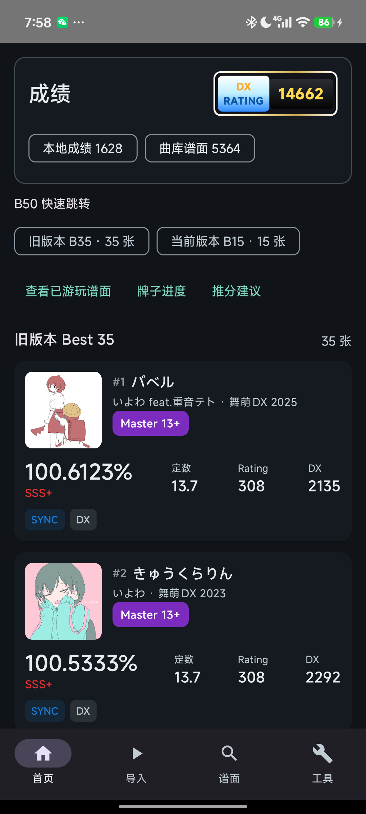
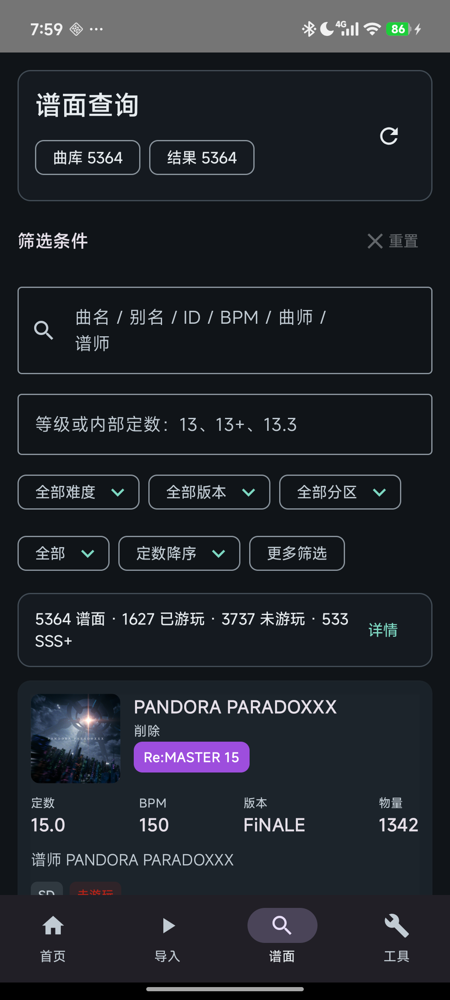
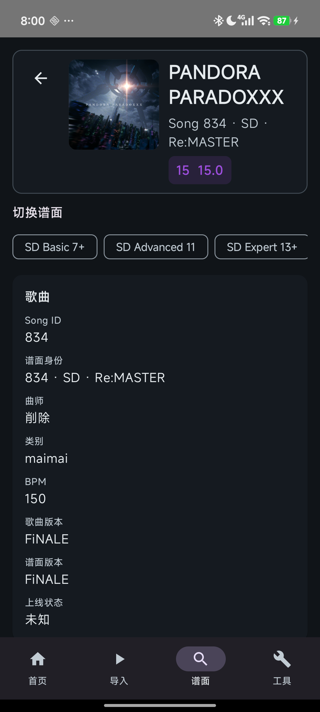
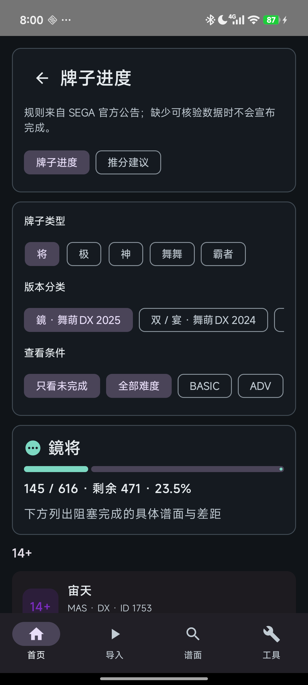
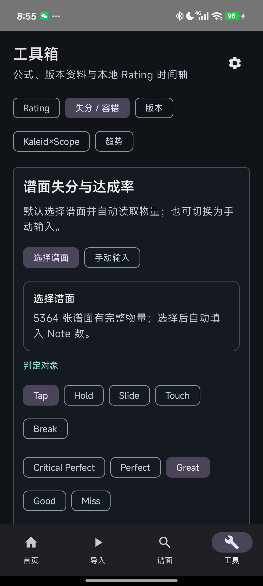

# FluentMai

[English](README.md) | [简体中文](README.zh-CN.md)

FluentMai 是面向 maimai DX 国服玩家的非官方 Android 本地成绩工具。项目目前处于公开 Beta，采用 local-first 设计，支持 Android 8.0 及以上系统；FluentMai 与 SEGA、华立、Diving Fish、LXNS 均无官方关联，也不代表或受其背书。

- [下载 FluentMai v0.2.0 Beta](https://github.com/Daozhu1007/FluentMai-Android/releases/tag/v0.2.0-beta)
- [隐私模型](docs/PRIVACY_MODEL.md)
- [产品范围](docs/PRODUCT_SCOPE.md)
- [更新日志](CHANGELOG.md)

## 项目简介

FluentMai 把成绩导入、整理和分析留在玩家自己的 Android 设备上。通过校验的成绩保存在本地 Room 数据库，并用于 B35/B15、Rating、谱面查询、玩家统计、牌子进度、趋势和推分建议；同步到社区服务始终是用户主动发起的可选操作。

Android 是当前正式维护和发布的平台。仓库中也包含实验性的 iOS 与 Kotlin Multiplatform 工作，但目前没有面向普通用户的可安装 iOS 版本。

## 主要功能

- 通过本地 Wahlap Hook 流程导入，必要时可切换到手动 fallback。
- 对导入成绩执行校验、稳定 SD/DX 谱面身份匹配与去重；有效记录写入 Room，可疑记录进入 quarantine，不混入正常成绩。
- 按正确的旧版本 B35 / 当前版本 B15 口径计算 DX Rating，不再把未来内容批次误判成当前大版本。
- 使用唯一的统一谱面浏览器，并从 B50、查询结果、牌子阻塞项和推分建议复用同一套谱面详情。
- 按曲名、社区别名、歌曲 ID、BPM、曲师、谱师搜索，支持离线简繁体归一化。
- 组合使用难度、版本、类别、定数范围、游玩状态、达成率/成绩等级、FC、FS、SD/DX 等完整筛选条件。
- 查看玩家成绩统计与数据驱动的牌子进度；数据不足时明确提示，不虚报完成。
- 使用单曲 Rating 计算器、版本名称对照，以及“选择谱面后自动读取 Note 数”的失分和达成率计算器；手动输入模式仍保留。
- 记录真实 Rating Trend，并通过 B35/B15 重算给出可解释推分建议；建议是确定性数学模拟，不预测个人技术或谱面适性。
- 按需将本地成绩上传到 Diving Fish 或 LXNS。
- 在手机横屏和平板上使用响应式布局，功能口径与手机竖屏一致。
- 新输入的上传 Token 与新的原始 Wahlap 导入页面只在当前会话/请求中流转，不新增持久化副本。

## 截图

| 首页 B50 | 统一谱面浏览器 | 统一谱面详情 |
| --- | --- | --- |
|  |  |  |

| 牌子进度 | 失分与达成率计算器 |
| --- | --- |
|  |  |

截图仅展示本地测试数据，不包含认证 URL、Token、Cookie 或原始导入页面。

## 下载与安装

FluentMai 最低支持 Android 8.0（`minSdk 26`），当前 target SDK 为 34（Android 14）。

1. 打开 [v0.2.0 Beta GitHub Release](https://github.com/Daozhu1007/FluentMai-Android/releases/tag/v0.2.0-beta)。
2. 下载 `FluentMai-v0.2.0-beta-android.apk`。
3. 直接覆盖安装已有应用；升级时不要卸载，也不要清除应用数据。
4. 如系统提示，请允许当前浏览器或文件管理器安装 APK。

仓库没有受信任的 release keystore，也没有 Android 自动签名发布流程，因此 v0.2.0 Beta 提供的是 debug-signed 测试构建。它面向公开 Beta 测试，不是稳定生产版本。

## 快速开始

1. 打开 FluentMai，进入“导入”。
2. 优先尝试 Wahlap Hook；如果上游流程要求，再使用手动 fallback。
3. 查看导入汇总，并检查被隔离到 quarantine 的异常记录。
4. 在首页确认 B35/B15；进入“谱面”可完成搜索、筛选、统计、牌子查看和详情浏览。
5. 在“工具”中使用 Rating、失分/达成率、版本对照、Rating Trend 和可解释推分建议。
6. 只有需要上传时才输入 Diving Fish 或 LXNS Token。Token 仅在当前会话使用，请勿在 issue 或日志中分享。

## 数据与隐私

- Android 端以本地 Room 数据库作为导入成绩的事实来源。
- 新的上传 Token、完整认证 URL 和原始 Wahlap 页面不会写入 Room 或普通应用存储，只在当前会话/请求链中短暂使用。
- 导入校验、保守匹配、去重与 quarantine 会阻止可疑记录静默覆盖有效成绩。
- 诊断文本在显示或记录前会脱敏；第三方上传响应按不可信文本处理。
- Diving Fish 与 LXNS 上传均为用户主动触发的可选操作。
- 应用升级不会主动删除旧版本可能已经留下的 Token/页面缓存。当前版本停止新增持久化副本，同时避免静默破坏用户已有应用数据。

详细边界见 [隐私模型](docs/PRIVACY_MODEL.md) 与 [导入管线](docs/IMPORT_PIPELINE.md)。

## 当前限制

- Wahlap 上游页面或第三方 API 发生变化时，导入或上传可能暂时失效，需要等待 FluentMai 更新。
- Kaleid×Scope 目前只有模型边界和“数据源待接入”状态，尚未接入完整且可审计的门曲/条件数据；应用不会伪造占位内容。
- Beta 版本仍可能有 UI 或设备兼容问题，当前不能宣称所有 Android 设备均已验证。
- 社区别名依赖经过校验的运行时数据源，可能不完整或暂时不可用；普通曲库字段搜索仍可使用。
- 推分建议只模拟单张谱面变化对 B35/B15 的数学影响，不预测玩家水平或谱面适性。
- 用户应为重要成绩保留应用外备份，尤其是在使用第三方 rebuild 或同步能力前。

## Android 构建

准备环境：

- 支持 API 34 的 Android SDK。
- JDK 17，或可将目标设为 Java 17 的兼容 JDK。
- 配置含 `sdk.dir` 的 `local.properties`，或设置 `ANDROID_HOME` / `ANDROID_SDK_ROOT`。

Windows：

```powershell
.\gradlew.bat test
.\gradlew.bat :app:assembleDebug
```

Unix/macOS：

```sh
./gradlew test
./gradlew :app:assembleDebug
```

Android 应用使用 Kotlin、Jetpack Compose、Room、coroutines、Ktor 与模块化 Gradle 工程。发布签名凭据不会保存在仓库中。

## iOS 当前状态

- 仓库包含实验性的 iOS MVP 和 Kotlin Multiplatform 共享领域层。
- iOS 尚未形成正式发布版本。
- 当前没有可供普通用户直接安装的 iOS Release。
- iOS 构建和真机验证仍在进行。
- Android 是当前正式维护和发布的平台。

需要在 Mac 上参与实验性 MVP 测试的开发者可阅读 [IOS_TESTING.md](IOS_TESTING.md)。iOS 不属于主要下载入口。

## 项目结构

- `app` — Android 入口、导航、平台网络和 Hook 集成。
- `core/model` — 成绩、Rating、版本、牌子、工具与推荐领域逻辑，也是 Kotlin Multiplatform 共享领域层。
- `core/importer` — Wahlap 解析、公开曲库处理、校验与导入管线。
- `core/database` — Android Room schema、迁移、DAO 与 repository。
- `core/privacy` — 诊断信息脱敏工具。
- `core/exporter`、`core/upload` — 上传 payload 与可选 Diving Fish/LXNS 流程。
- `feature/home`、`feature/import`、`feature/scores`、`feature/quarantine`、`feature/settings`、`feature/tools` — Android Compose 功能模块。
- `iosApp` — 实验性 SwiftUI MVP，不属于本次 Android Release。
- `fixtures` — 随包提供的公开 fallback 或合成测试数据。
- `docs` — 数据契约、隐私、导入、牌子、别名、工具与推荐说明。

## 第三方数据与致谢

FluentMai 使用 LXNS 的公开曲库/版本元数据与已文档化 API、Diving Fish 和 LXNS 的可选上传接口、运行时获取的 LXNS 与 YuzuChaN 社区别名，以及 SEGA 公开规则/页面来校验计分和牌子语义。别名数据只在本地校验和缓存以供搜索，仓库不会复制分发社区别名库。

MaiproberPlus、EasyMai、maimai.py 等社区项目仅作为公开实现或行为的只读参考。提及这些项目不代表合作、背书或官方关系。依赖声明见 [THIRD_PARTY_NOTICES.md](THIRD_PARTY_NOTICES.md)。

## 免责声明

FluentMai 是面向 maimai DX 国服的独立非官方玩家工具，与 SEGA、华立、Diving Fish、LXNS、RankHub、EasyMai 及其运营方不存在隶属、授权或背书关系。游戏名称、曲绘、音乐元数据和商标归各自权利方所有。

使用应用及第三方上传服务的风险由用户自行承担。上游变化可能使导入或同步失效，重要数据应在应用外另行备份。
